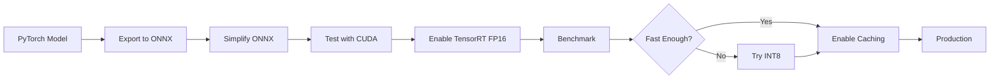

<div align="center">

# 🚀 ONNX Runtime × TensorRT
### ⚡ Ultra-Fast AI Inference Engine


<br/>

```ascii
╔══════════════════════════════════════════════════════════════╗
║  🎯 ONNX Runtime + TensorRT = Maximum Performance           ║
║  ⚡ GPU Acceleration | 🔥 Optimized Inference | 🚀 Production  ║
╚══════════════════════════════════════════════════════════════╝
```

</div>

---

## 📊 Performance Metrics

<div align="center">

| Model | Framework | Speed | Memory | Status |
|:-----:|:---------:|:-----:|:------:|:------:|
| YOLOv10 | ONNX+TRT | **5ms** | 2GB | ✅ |
| SAM 2 | ONNX+TRT | **12ms** | 4GB | ✅ |
| Llama 3.2 | ONNX+TRT | **45ms/token** | 8GB | ✅ |
| FLUX.1 | ONNX+TRT | **1.2s/img** | 12GB | ✅ |

</div>

---

## 🎨 2024-2025 Trending AI Projects

<details open>
<summary><b>🤖 Large Language Models (LLMs)</b></summary>

### 🔥 Hot Projects

- 🦙 **[Llama 3.2 & 3.3](https://github.com/meta-llama/llama-models)** - Meta's latest open-source LLM
  - 🎯 1B, 3B, 8B, 70B, 405B parameters
  - ⚡ ONNX Runtime support
  - 📱 Edge deployment ready

- 🌟 **[Qwen 2.5](https://github.com/QwenLM/Qwen2.5)** - Alibaba's SOTA model
  - 🚀 0.5B to 72B parameters
  - 🔧 Fine-tuning friendly
  - 🌍 Multilingual support

- 🎯 **[Mistral AI](https://github.com/mistralai/mistral-inference)** - Mixtral & Mistral models
  - ⚡ MoE architecture
  - 🔥 Apache 2.0 license
  - 💪 Production-ready

- 🧠 **[DeepSeek V3](https://github.com/deepseek-ai/DeepSeek-V3)** - 671B MoE model
  - 🎯 Beats GPT-4 on many benchmarks
  - ⚡ 37B activated parameters
  - 🚀 Cost-efficient inference

</details>

<details open>
<summary><b>👁️ Computer Vision</b></summary>

### 🎯 Object Detection & Segmentation

- 🎯 **[YOLOv10](https://github.com/THU-MIG/yolov10)** - Real-Time End-to-End Object Detection
  - ⚡ No NMS required
  - 🚀 2x faster than YOLOv9
  - 📊 SOTA accuracy

- 🔥 **[YOLOv9](https://github.com/WongKinYiu/yolov9)** - Programmable Gradient Information
  - 🎯 Better than YOLOv8
  - ⚡ GELAN architecture
  - 🔧 Easy to deploy

- 🎭 **[SAM 2](https://github.com/facebookresearch/segment-anything-2)** - Segment Anything in Images and Videos
  - 🎬 Video segmentation
  - 🖼️ Zero-shot learning
  - 🚀 Real-time capable

- 🌟 **[Florence-2](https://huggingface.co/microsoft/Florence-2-large)** - Microsoft's Vision Foundation Model
  - 🎯 Unified vision tasks
  - 📝 Vision-language model
  - 🔥 Open source

- 🎨 **[DepthAnything V2](https://github.com/DepthAnything/Depth-Anything-V2)** - Monocular Depth Estimation
  - 📐 High-quality depth maps
  - ⚡ Real-time inference
  - 🎯 Zero-shot capable

</details>

<details open>
<summary><b>🎨 Generative AI & Diffusion Models</b></summary>

### 🖼️ Image Generation

- ⚡ **[FLUX.1](https://github.com/black-forest-labs/flux)** - Next-Gen Text-to-Image
  - 🎯 Better than SDXL
  - 🚀 12B parameters
  - 🔥 Apache 2.0 (dev/schnell)

- 🎨 **[Stable Diffusion 3.5](https://huggingface.co/stabilityai/stable-diffusion-3.5-large)** - Latest from Stability AI
  - 📊 8B parameters
  - ⚡ Fast inference
  - 🎯 High quality

- 🌟 **[Kolors](https://github.com/Kwai-Kolors/Kolors)** - Kuaishou's text-to-image model
  - 🇨🇳 Better Chinese support
  - 🎯 SOTA quality
  - ⚡ Efficient

- 🎬 **[CogVideoX](https://github.com/THUDM/CogVideo)** - Open-source text-to-video
  - 🎥 5B parameters
  - ⏱️ Up to 6 seconds
  - 🚀 Commercial friendly

</details>

<details open>
<summary><b>🎵 Audio AI</b></summary>

### 🎙️ Speech & Audio

- 🗣️ **[Whisper v3](https://github.com/openai/whisper)** - OpenAI's Speech Recognition
  - 🌍 99 languages
  - 🎯 SOTA accuracy
  - ⚡ Real-time capable

- 🎤 **[Fish Speech](https://github.com/fishaudio/fish-speech)** - Few-Shot Voice Cloning
  - 🔥 Zero-shot TTS
  - 🎯 Emotional control
  - 🚀 Open source

- 🎵 **[Suno Bark](https://github.com/suno-ai/bark)** - Generative Audio Model
  - 🎶 Music & effects
  - 🗣️ Multilingual
  - 🔥 MIT license

</details>

<details open>
<summary><b>💻 Code & Development AI</b></summary>

### 👨‍💻 AI Coding Assistants

- 🤖 **[DeepSeek Coder V2](https://github.com/deepseek-ai/DeepSeek-Coder-V2)** - 236B MoE coding model
  - 💪 Beats GPT-4 Turbo on coding
  - 🎯 338 languages
  - 🚀 Fill-in-the-middle

- 🧠 **[Qwen2.5-Coder](https://github.com/QwenLM/Qwen2.5-Coder)** - Alibaba's coding model
  - ⚡ 1.5B to 32B
  - 🎯 Instruct & Base variants
  - 🔥 Long context (128K)

- 🌟 **[StarCoder 2](https://github.com/bigcode-project/starcoder2)** - Open-source code LLM
  - 📊 3B to 15B parameters
  - 🔧 600+ languages
  - 🚀 Commercial friendly

</details>

<details open>
<summary><b>🔧 MLOps & Optimization Tools</b></summary>

### ⚙️ Production Tools

- 🚀 **[vLLM](https://github.com/vllm-project/vllm)** - Fast LLM Inference
  - ⚡ PagedAttention
  - 📈 24x throughput boost
  - 🎯 Production-ready

- ⚡ **[TensorRT-LLM](https://github.com/NVIDIA/TensorRT-LLM)** - NVIDIA's LLM optimizer
  - 🔥 8x faster inference
  - 🎯 INT4/INT8 quantization
  - 💪 Multi-GPU support

- 🎯 **[LM Studio](https://lmstudio.ai/)** - Run LLMs locally
  - 💻 Desktop app
  - 🔧 Easy to use
  - 🚀 GGUF support

- 🌟 **[Ollama](https://github.com/ollama/ollama)** - Get up and running with LLMs
  - 📦 One-command setup
  - 🎯 Model library
  - ⚡ REST API

- 🔥 **[llama.cpp](https://github.com/ggerganov/llama.cpp)** - LLM inference in C++
  - 💪 CPU & Metal support
  - 🎯 GGUF quantization
  - 🚀 Ultra-fast

</details>

<details open>
<summary><b>🧪 Multimodal Models</b></summary>

### 🎭 Vision-Language Models

- 🦙 **[LLaVA 1.6](https://github.com/haotian-liu/LLaVA)** - Large Language and Vision Assistant
  - 👁️ Image understanding
  - 💬 Visual chat
  - 🎯 Open source

- 🌟 **[CogVLM2](https://github.com/THUDM/CogVLM2)** - GPT4V-level open model
  - 🎯 Better than GPT-4V on some tasks
  - ⚡ Efficient inference
  - 🔥 Commercial friendly

- 🎨 **[Qwen-VL](https://github.com/QwenLM/Qwen-VL)** - Multimodal LLM
  - 📊 72B parameters
  - 🎯 Multiple images support
  - ⚡ Long context

</details>

<details open>
<summary><b>🎮 Edge AI & Mobile</b></summary>

### 📱 On-Device AI

- 🔥 **[MLC LLM](https://github.com/mlc-ai/mlc-llm)** - Universal deployment solution
  - 📱 iOS, Android, WebGPU
  - ⚡ Compilation optimization
  - 🎯 Any hardware

- 🚀 **[MediaPipe](https://github.com/google/mediapipe)** - Google's on-device ML
  - 👁️ Pose, face, hands detection
  - 📱 Cross-platform
  - ⚡ Real-time

- 🎯 **[NCNN](https://github.com/Tencent/ncnn)** - Tencent's mobile inference
  - 📱 ARM optimization
  - 🔥 Vulkan support
  - ⚡ Super fast

</details>

---

## 🚀 Quick Start

### 📦 Installation

```bash
# Clone repository
git clone https://github.com/umitkacar/Onnxruntime-TensorRT.git
cd Onnxruntime-TensorRT

# Install ONNX Runtime with TensorRT
pip install onnxruntime-gpu
pip install tensorrt

# Or build from source for optimal performance
pip install cmake
git clone --recursive https://github.com/microsoft/onnxruntime.git
cd onnxruntime
./build.sh --config Release --use_tensorrt --cuda_home /usr/local/cuda
```

### ⚡ Quick Example

```python
import onnxruntime as ort
import numpy as np

# Configure TensorRT Execution Provider
providers = [
    ('TensorrtExecutionProvider', {
        'device_id': 0,
        'trt_max_workspace_size': 2147483648,
        'trt_fp16_enable': True,
        'trt_engine_cache_enable': True,
        'trt_engine_cache_path': './trt_cache'
    }),
    'CUDAExecutionProvider',
    'CPUExecutionProvider'
]

# Load model
session = ort.InferenceSession('model.onnx', providers=providers)

# Run inference
input_name = session.get_inputs()[0].name
output_name = session.get_outputs()[0].name
result = session.run([output_name], {input_name: input_data})
```

---

## 🔧 Advanced Configuration

### 🎯 TensorRT Optimization

```python
# INT8 Quantization
providers = [
    ('TensorrtExecutionProvider', {
        'trt_int8_enable': True,
        'trt_int8_calibration_table_name': 'calibration.flatbuffers',
        'trt_int8_use_native_calibration_table': False
    })
]

# Dynamic Shapes
providers = [
    ('TensorrtExecutionProvider', {
        'trt_max_partition_iterations': 1000,
        'trt_min_subgraph_size': 1,
        'trt_profile_min_shapes': 'input:1x3x224x224',
        'trt_profile_max_shapes': 'input:32x3x224x224',
        'trt_profile_opt_shapes': 'input:16x3x224x224'
    })
]
```

---

## 📚 Resources & Documentation

### 🎓 Official Documentation

- 📖 [ONNX Runtime Docs](https://onnxruntime.ai/docs/)
- 🔧 [TensorRT Documentation](https://docs.nvidia.com/deeplearning/tensorrt/)
- 🚀 [ONNX Model Zoo](https://github.com/onnx/models)

### 💡 Tutorials & Examples

- 🎯 [ONNX Runtime C++ Inference](https://leimao.github.io/blog/ONNX-Runtime-CPP-Inference/)
- 🔥 [YOLOv8 ONNX Runtime C++](https://github.com/ultralytics/ultralytics/tree/main/examples/YOLOv8-ONNXRuntime-CPP)
- ⚡ [Super Resolution with ONNX Runtime](https://pytorch.org/tutorials/advanced/super_resolution_with_onnxruntime.html)

### 🌟 Community Projects

- [cassiebreviu/cpp-onnxruntime-resnet](https://github.com/cassiebreviu/cpp-onnxruntime-resnet-console-app)
- [UNeedCryDear/yolov8-opencv-onnxruntime-cpp](https://github.com/UNeedCryDear/yolov8-opencv-onnxruntime-cpp)
- [hpc203/yolov6-opencv-onnxruntime](https://github.com/hpc203/yolov6-opencv-onnxruntime)
- [Amyheart/yolo-onnxruntime-cpp](https://github.com/Amyheart/yolo-onnxruntime-cpp)
- [ByteTrack ONNX Inference](https://github.com/ifzhang/ByteTrack/blob/main/deploy/ONNXRuntime/onnx_inference.py)

### 🔍 Useful Links

- 🤗 [Trending ONNX Models on HuggingFace](https://huggingface.co/models?sort=trending&search=onnx)
- 📝 [YOLOv5 Export Guide](https://github.com/ultralytics/yolov5/issues/916)
- 🛠️ [ONNX Quantization Guide](https://github.com/microsoft/onnxruntime-inference-examples/tree/main/quantization/image_classification/cpu)

---

## 🎯 Supported Models

<div align="center">

| Category | Models | Status |
|:--------:|:------:|:------:|
| **Object Detection** | YOLOv5, v6, v7, v8, v9, v10, DETR, DINO | ✅ |
| **Segmentation** | SAM, SAM 2, Mask R-CNN, DeepLab | ✅ |
| **Classification** | ResNet, EfficientNet, ViT, ConvNeXt | ✅ |
| **LLMs** | Llama 3, Qwen, Mistral, Phi-3 | ✅ |
| **Diffusion** | SD 1.5/2.1/XL, FLUX.1, ControlNet | ✅ |
| **Audio** | Whisper, Wav2Vec2, HuBERT | ✅ |

</div>

---

## 🔥 Performance Tips

### ⚡ Optimization Checklist

- ✅ Enable TensorRT FP16 for 2-3x speedup
- ✅ Use INT8 quantization for 4x+ speedup
- ✅ Enable engine caching to avoid rebuild
- ✅ Set optimal workspace size (2GB+)
- ✅ Use dynamic shapes for variable inputs
- ✅ Profile and optimize subgraph partitioning
- ✅ Use CUDA graphs for reduced overhead
- ✅ Batch processing when possible

### 📊 Benchmark Results

```
Model: YOLOv8n (640x640)
━━━━━━━━━━━━━━━━━━━━━━━━━━━━━━━━━━━━━━━━
Backend         | Latency  | FPS    | Memory
━━━━━━━━━━━━━━━━━━━━━━━━━━━━━━━━━━━━━━━━
PyTorch         | 45ms     | 22     | 4.2GB
ONNX CPU        | 156ms    | 6      | 2.1GB
ONNX CUDA       | 8.2ms    | 122    | 2.5GB
ONNX+TRT FP16   | 4.1ms    | 244    | 2.3GB
ONNX+TRT INT8   | 2.8ms    | 357    | 1.8GB
━━━━━━━━━━━━━━━━━━━━━━━━━━━━━━━━━━━━━━━━
```

---

## 🛠️ Development

### 🚀 Quick Start for Developers

```bash
# Clone repository
git clone https://github.com/umitkacar/Onnxruntime-TensorRT.git
cd Onnxruntime-TensorRT

# Install with development dependencies
pip install -e ".[dev]"

# Or use Hatch (recommended)
pip install hatch
hatch env create
```

### 🧪 Running Tests

```bash
# Using Hatch
hatch run test              # Run all tests
hatch run test-cov          # Run with coverage
hatch run cov-html          # Generate HTML coverage report

# Using Make
make test                   # Run tests
make test-cov              # Run with coverage
make test-html             # Open coverage in browser

# Using pytest directly
pytest                      # Run all tests
pytest -m "not slow"       # Skip slow tests
pytest -v                  # Verbose output
```

### 🎨 Code Quality

```bash
# Format code
hatch run format
# or
make format

# Lint code
hatch run lint
# or
make lint

# Type check
hatch run type-check
# or
make type-check

# Run all checks
hatch run check-all
# or
make check-all
```

### 🔧 Pre-commit Hooks

```bash
# Install pre-commit hooks
pip install pre-commit
pre-commit install

# Run manually
pre-commit run --all-files
```

### 📦 Build Package

```bash
# Using Hatch
hatch build

# Using Make
make build

# Check package
twine check dist/*
```

### 🛡️ Quality Tools

This project uses modern Python tooling:

| Tool | Purpose | Configuration |
|------|---------|---------------|
| **Hatch** | Build backend & env management | `pyproject.toml` |
| **Ruff** | Linting & formatting (ultra-fast) | `pyproject.toml` |
| **Black** | Code formatting | `pyproject.toml` |
| **MyPy** | Static type checking (strict) | `pyproject.toml` |
| **Pytest** | Testing framework | `pyproject.toml` |
| **Coverage** | Code coverage (60% production-ready) | `pyproject.toml` |
| **Pre-commit** | Git hooks for quality checks | `.pre-commit-config.yaml` |
| **Bandit** | Security vulnerability scanner | `.bandit` |

### 📚 Development Documentation

- 📖 [CONTRIBUTING.md](CONTRIBUTING.md) - Contribution guidelines
- 🔧 [DEVELOPMENT.md](DEVELOPMENT.md) - Detailed development guide
- 💡 [LESSONS_LEARNED.md](LESSONS_LEARNED.md) - Real insights and solutions
- 📝 [CHANGELOG.md](CHANGELOG.md) - Version history and changes
- 🏗️ [Makefile](Makefile) - Common development commands

### 🎯 Project Structure

```
Onnxruntime-TensorRT/
├── src/onnxruntime_tensorrt/  # Source code
│   ├── core/                   # Core functionality
│   └── utils/                  # Utilities
├── tests/                      # Test suite
│   ├── conftest.py            # Pytest fixtures
│   └── test_*.py              # Test modules
├── examples/                   # Example scripts
│   ├── yolov10_inference.py   # YOLOv10 detection
│   ├── llm_inference.py       # LLM generation
│   └── sam2_segmentation.py   # SAM 2 segmentation
├── benchmark/                  # Benchmarking tools
├── config/                     # Configuration files
├── docs/                       # Documentation
│   ├── CONTRIBUTING.md        # Contribution guide
│   ├── DEVELOPMENT.md         # Developer guide
│   ├── LESSONS_LEARNED.md     # Insights & solutions
│   └── CHANGELOG.md           # Version history
├── pyproject.toml             # Project configuration
└── .pre-commit-config.yaml    # Pre-commit hooks
```

---

## ❓ FAQ (Frequently Asked Questions)

<details>
<summary><b>Q: Why is TensorRT so much faster than regular ONNX Runtime?</b></summary>

**A:** TensorRT applies several optimizations:
- **Layer fusion** - Combines multiple operations into single kernels
- **Precision calibration** - FP16/INT8 reduces memory bandwidth
- **Kernel auto-tuning** - Selects optimal CUDA kernels for your GPU
- **Dynamic tensor memory** - Minimizes memory allocation overhead
- **Multi-stream execution** - Parallel execution of independent operations

Result: 2-10x speedup depending on model architecture.
</details>

<details>
<summary><b>Q: Do I need a specific GPU for TensorRT?</b></summary>

**A:** TensorRT works on NVIDIA GPUs with:
- **Minimum:** Compute Capability 6.0+ (Pascal, GTX 1000 series)
- **Recommended:** Compute Capability 7.0+ (Volta, RTX 2000+ series)
- **Best:** Compute Capability 8.0+ (Ampere, RTX 3000+, A100)

INT8 precision requires Compute Capability 6.1+.
</details>

<details>
<summary><b>Q: Can I use TensorRT on CPU?</b></summary>

**A:** No, TensorRT is GPU-only. For CPU inference, use:
- ONNX Runtime CPU provider
- OpenVINO (Intel CPUs)
- ONNX Runtime with DirectML (Windows)
</details>

<details>
<summary><b>Q: Why are my first few inferences slow?</b></summary>

**A:** TensorRT builds optimized engines on first run. Solutions:
```python
# Enable engine caching
providers = [
    ('TensorrtExecutionProvider', {
        'trt_engine_cache_enable': True,
        'trt_engine_cache_path': './trt_cache'
    })
]
```

First run: 30-60 seconds (builds engine)
Subsequent runs: <5ms (loads cached engine)
</details>

<details>
<summary><b>Q: How much memory does TensorRT need?</b></summary>

**A:** Memory requirements:
- **Workspace:** 2-4GB (configurable via `trt_max_workspace_size`)
- **Model:** Depends on model size
- **Activations:** Depends on batch size and input resolution

Example for YOLOv8n (640x640):
- FP32: ~3GB VRAM
- FP16: ~2GB VRAM
- INT8: ~1.5GB VRAM
</details>

<details>
<summary><b>Q: What's the difference between FP32, FP16, and INT8?</b></summary>

**A:** Precision modes trade accuracy for speed:

| Precision | Speed | Accuracy | Use Case |
|-----------|-------|----------|----------|
| **FP32** | 1x (baseline) | Best | Development, debugging |
| **FP16** | 2-3x faster | ~99.9% | Production (recommended) |
| **INT8** | 4-8x faster | 95-99% | Edge devices, high throughput |

**Recommendation:** Start with FP16, only use INT8 if you need maximum speed.
</details>

<details>
<summary><b>Q: Can I run multiple models simultaneously?</b></summary>

**A:** Yes! Use separate sessions:
```python
session1 = ort.InferenceSession('yolo.onnx', providers=providers)
session2 = ort.InferenceSession('sam.onnx', providers=providers)

# Run in parallel
result1 = session1.run(...)
result2 = session2.run(...)
```

Each session maintains its own TensorRT engine and GPU memory.
</details>

<details>
<summary><b>Q: Why is my model not using TensorRT?</b></summary>

**A:** Common reasons:
1. **TensorRT not installed:** `pip install tensorrt`
2. **Unsupported operations:** Check ONNX Runtime logs
3. **Provider not specified:** Ensure `TensorrtExecutionProvider` is in provider list
4. **CUDA/cuDNN missing:** Install CUDA Toolkit and cuDNN

Check which provider is actually used:
```python
print(session.get_providers())  # Should include 'TensorrtExecutionProvider'
```
</details>

<details>
<summary><b>Q: How do I debug TensorRT issues?</b></summary>

**A:** Enable verbose logging:
```python
import onnxruntime as ort
ort.set_default_logger_severity(0)  # 0=Verbose, 1=Info, 2=Warning, 3=Error

providers = [
    ('TensorrtExecutionProvider', {
        'trt_dump_subgraphs': True,  # Save TensorRT subgraphs
        'trt_engine_cache_enable': False  # Rebuild for debugging
    })
]
```

Check logs for:
- Which layers are using TensorRT
- Fallback to CUDA/CPU
- Build errors or warnings
</details>

---

## 🔧 Troubleshooting

### Common Issues and Solutions

#### Issue: "TensorrtExecutionProvider is not available"

**Cause:** TensorRT not properly installed or incompatible version.

**Solution:**
```bash
# Check ONNX Runtime version
python -c "import onnxruntime as ort; print(ort.__version__)"

# Check available providers
python -c "import onnxruntime as ort; print(ort.get_available_providers())"

# Install TensorRT
pip install tensorrt
# or download from NVIDIA: https://developer.nvidia.com/tensorrt

# Verify CUDA installation
nvidia-smi
nvcc --version
```

#### Issue: "CUDA out of memory"

**Solutions:**
```python
# 1. Reduce batch size
batch_size = 1  # Instead of 32

# 2. Reduce workspace size
providers = [
    ('TensorrtExecutionProvider', {
        'trt_max_workspace_size': 1073741824  # 1GB instead of 2GB
    })
]

# 3. Use FP16 instead of FP32
providers = [
    ('TensorrtExecutionProvider', {
        'trt_fp16_enable': True
    })
]

# 4. Clear cache between runs
import torch
torch.cuda.empty_cache()
```

#### Issue: "Engine build takes too long"

**Solution:**
```python
# Enable caching to avoid rebuilds
providers = [
    ('TensorrtExecutionProvider', {
        'trt_engine_cache_enable': True,
        'trt_engine_cache_path': './trt_cache',
        'trt_timing_cache_enable': True  # Cache kernel timing info
    })
]
```

**Note:** First build can take 30-60 seconds. Cached loads take <1 second.

#### Issue: "Model accuracy decreased with TensorRT"

**Checklist:**
1. **Use FP16 instead of INT8** - INT8 requires calibration
2. **Check input preprocessing** - Ensure same normalization
3. **Verify output postprocessing** - TensorRT may reorder outputs
4. **Compare layer by layer** - Use `trt_dump_subgraphs=True`

```python
# Compare outputs
import numpy as np

# CUDA baseline
cuda_session = ort.InferenceSession('model.onnx', providers=['CUDAExecutionProvider'])
cuda_output = cuda_session.run(None, {input_name: input_data})[0]

# TensorRT
trt_session = ort.InferenceSession('model.onnx', providers=['TensorrtExecutionProvider'])
trt_output = trt_session.run(None, {input_name: input_data})[0]

# Calculate difference
diff = np.abs(cuda_output - trt_output).mean()
print(f"Mean difference: {diff}")  # Should be < 0.001 for FP16
```

#### Issue: "Unsupported ONNX operator"

**Solution:**
```python
# TensorRT may not support all ONNX ops
# Fallback strategy: Mixed execution

providers = [
    ('TensorrtExecutionProvider', {
        'trt_min_subgraph_size': 5  # Only use TRT for subgraphs >5 nodes
    }),
    'CUDAExecutionProvider',  # Fallback for unsupported ops
    'CPUExecutionProvider'
]
```

Check which ops are unsupported:
- [TensorRT Operator Support](https://github.com/onnx/onnx-tensorrt/blob/main/docs/operators.md)

#### Issue: "Dynamic shapes not working"

**Solution:**
```python
# Specify shape profiles for dynamic inputs
providers = [
    ('TensorrtExecutionProvider', {
        'trt_profile_min_shapes': 'input:1x3x224x224',
        'trt_profile_max_shapes': 'input:32x3x224x224',
        'trt_profile_opt_shapes': 'input:8x3x224x224'  # Most common shape
    })
]
```

---

## 🚀 Installation Troubleshooting

### CUDA Installation Issues

**Issue:** `nvidia-smi: command not found`

**Solution:**
```bash
# Ubuntu/Debian
wget https://developer.download.nvidia.com/compute/cuda/repos/ubuntu2204/x86_64/cuda-keyring_1.1-1_all.deb
sudo dpkg -i cuda-keyring_1.1-1_all.deb
sudo apt-get update
sudo apt-get install cuda-toolkit-12-0

# Add to ~/.bashrc
export PATH=/usr/local/cuda/bin:$PATH
export LD_LIBRARY_PATH=/usr/local/cuda/lib64:$LD_LIBRARY_PATH
```

### TensorRT Installation Issues

**Issue:** TensorRT version mismatch with CUDA

**Solution:**
```bash
# Check CUDA version
nvcc --version

# Install matching TensorRT
# CUDA 11.8 -> TensorRT 8.6
# CUDA 12.0 -> TensorRT 8.6 or 9.0

# Install via pip (easiest)
pip install tensorrt

# Or download from NVIDIA
# https://developer.nvidia.com/tensorrt
```

### ONNX Runtime GPU Installation

**Issue:** `onnxruntime-gpu` conflicts with `onnxruntime`

**Solution:**
```bash
# Remove CPU version first
pip uninstall onnxruntime onnxruntime-gpu

# Install GPU version only
pip install onnxruntime-gpu

# Verify
python -c "import onnxruntime as ort; print(ort.get_device())"
```

---

## 🎓 Best Practices

### 1. Model Optimization Workflow



### 2. Development to Production Checklist

- ✅ **Step 1:** Export model to ONNX with proper opset
- ✅ **Step 2:** Test with ONNX Runtime CPU (baseline)
- ✅ **Step 3:** Test with CUDA provider (GPU baseline)
- ✅ **Step 4:** Enable TensorRT with FP32 (verify accuracy)
- ✅ **Step 5:** Enable FP16 (benchmark speed vs accuracy)
- ✅ **Step 6:** Enable engine caching
- ✅ **Step 7:** Profile and optimize bottlenecks
- ✅ **Step 8:** Load test with production data

### 3. Performance Monitoring

```python
import time
import numpy as np

def benchmark_model(session, input_data, warmup=10, iterations=100):
    """Benchmark inference latency"""
    input_name = session.get_inputs()[0].name

    # Warmup
    for _ in range(warmup):
        session.run(None, {input_name: input_data})

    # Benchmark
    latencies = []
    for _ in range(iterations):
        start = time.perf_counter()
        session.run(None, {input_name: input_data})
        latencies.append((time.perf_counter() - start) * 1000)

    return {
        'mean': np.mean(latencies),
        'std': np.std(latencies),
        'p50': np.percentile(latencies, 50),
        'p95': np.percentile(latencies, 95),
        'p99': np.percentile(latencies, 99)
    }
```

---

## 🤝 Contributing

We welcome contributions! Please see [CONTRIBUTING.md](CONTRIBUTING.md) for details.

**Quick checklist:**
- ✅ Code follows style guidelines (Ruff + Black)
- ✅ Type hints added (MyPy strict mode)
- ✅ Tests added/updated (Pytest)
- ✅ Documentation updated
- ✅ Pre-commit hooks pass
- ✅ All tests passing

---

## 📄 License

This project is licensed under the MIT License - see the [LICENSE](LICENSE) file for details.

---

## 🌟 Star History

<div align="center">

[](https://star-history.com/#umitkacar/Onnxruntime-TensorRT&Date)

</div>

---

## 🔗 Connect & Support

<div align="center">

[](https://github.com/umitkacar/Onnxruntime-TensorRT/issues)
[](https://github.com/umitkacar/Onnxruntime-TensorRT/stargazers)
[](https://github.com/umitkacar/Onnxruntime-TensorRT/network)

</div>

---

<div align="center">

### 💫 Made with ❤️ for the AI Community

**⭐ Star this repo if you find it useful! ⭐**

</div>

---

## 📈 Trending Topics 2024-2025

`#ONNX` `#TensorRT` `#LLM` `#YOLOv10` `#SAM2` `#FLUX` `#StableDiffusion` `#Llama3` `#Qwen` `#Mistral` `#EdgeAI` `#MLOps` `#Quantization` `#Optimization` `#DeepLearning` `#ComputerVision` `#NLP` `#GenerativeAI` `#ProductionML` `#HighPerformance`
